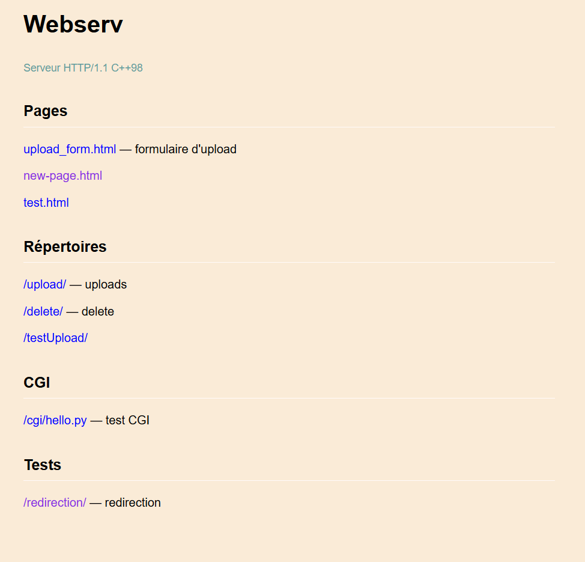

# Webserv

Serveur HTTP/1.1 réalisé en C++98 dans le cadre du projet [42](https://42.fr).



## Description

Ce projet est une implémentation d'un serveur HTTP conforme à la norme 1.1, développé en C++98. Il permet d'héberger des pages web, de gérer l'upload de fichiers, la suppression, l'exécution de scripts CGI, ainsi que la gestion des redirections, conformément aux attentes du sujet Webserv de l'école 42.

## Fonctionnalités

- **Gestion des pages statiques :**
  - `upload_form.html` — formulaire d'upload
  - `new-page.html`
  - `test.html`

- **Gestion des répertoires :**
  - `/upload/` — stockage des fichiers uploadés
  - `/delete/` — suppression de fichiers
  - `/testUpload/` — pour tests d'upload

- **Support CGI :**
  - `/cgi/hello.py` — exemple de script CGI en Python

- **Tests :**
  - `/redirection` — validation des redirections HTTP

## Prérequis

- Système UNIX (Linux ou macOS recommandé)
- C++98 compatible (g++ ou clang++)
- Python (pour l'exécution des scripts CGI)

## Installation

```bash
git clone https://github.com/gchinaul/Web-Serv.git
cd Web-Serv
make
```

## Utilisation

1. **Lancer le serveur :**
   ```bash
   ./webserv [config.conf]
   ```
   Un fichier de configuration exemple (`config.conf`) est fourni.

2. **Accéder aux pages :**
   - http://localhost:8080/upload_form.html  
   - http://localhost:8080/new-page.html  
   - http://localhost:8080/test.html

3. **Fonctionnalités avancées :**
   - Upload, suppression, accès à CGI et pages de test par les routes listées ci-dessus.

## Auteur

Projet réalisé par [gchinaul](https://github.com/gchinaul) dans le cadre de l'école 42.

## Licence

Ce projet est sous licence MIT.

---

> Pour toute suggestion ou question, n'hésitez pas à ouvrir une issue sur le repository.
